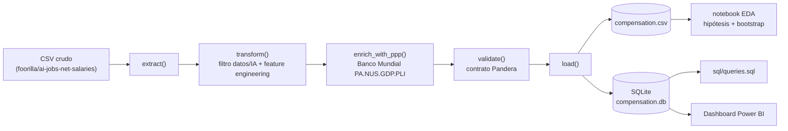
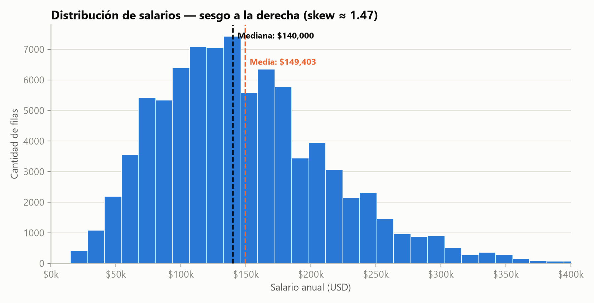
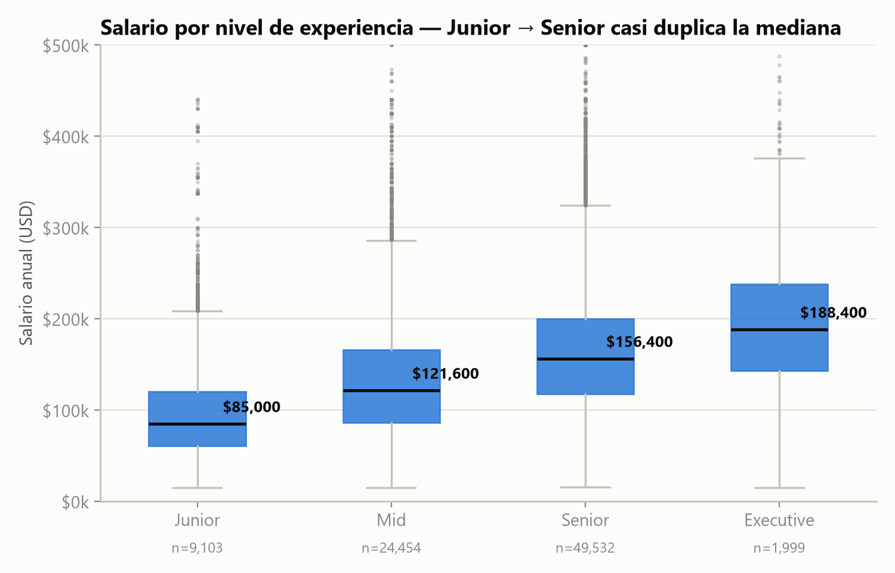
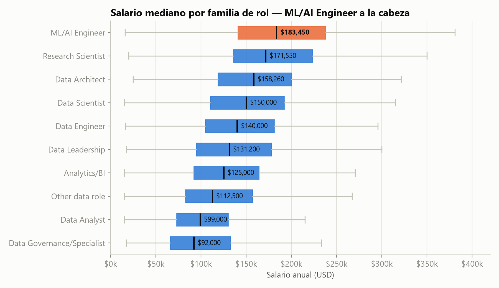
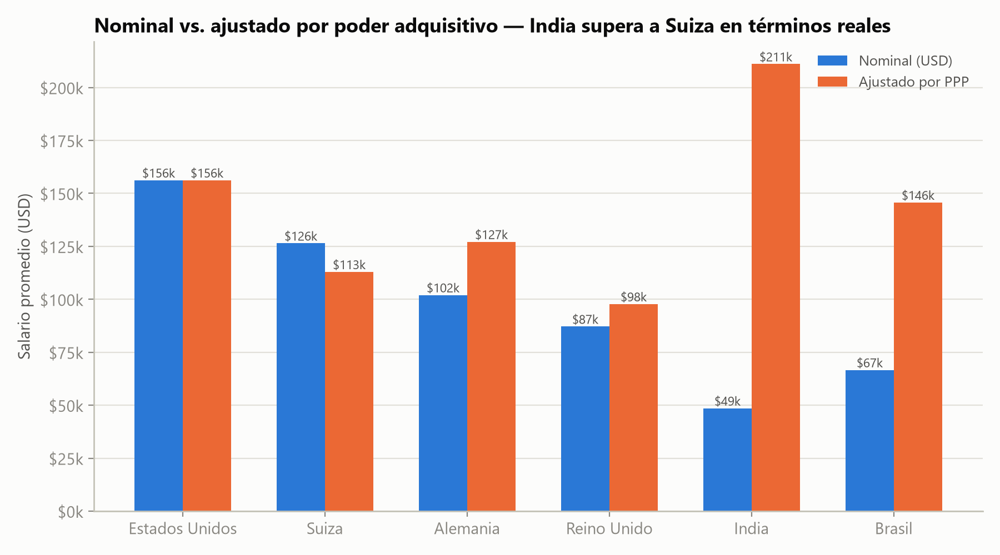

# Data & AI Compensation Benchmark — Caso de estudio

Benchmark end-to-end de compensación para profesionales de datos e IA a nivel global: ETL con contrato de datos, análisis exploratorio con rigor estadístico (pruebas de hipótesis, intervalos de confianza por bootstrap, ajuste por poder adquisitivo), consultas SQL de negocio y un dashboard interactivo en Power BI — construido para responder una pregunta doble: qué factores explican la compensación, y qué tan defendibles son esas diferencias dado el tamaño real de la muestra.

**Repositorio:** [github.com/ayorick23/data-ai-compensation-benchmark](https://github.com/ayorick23/data-ai-compensation-benchmark)

## De un vistazo

| Métrica                          | Valor                                         |
| -------------------------------- | --------------------------------------------- |
| Filas analizadas                 | 85,088 (2020–2025)                            |
| Familias de rol evaluadas        | 9                                             |
| Países con datos                 | 90 (59 con muestra ≥ 5)                       |
| Brecha Junior → Senior (mediana) | $85,000 → $156,400 (+84%, Mann-Whitney p ≈ 0) |
| Especialización mejor pagada     | ML/AI Engineer ($183,450 mediana)             |
| Tests automatizados              | 31                                            |
| Decisiones documentadas (ADR)    | 11                                            |

---

## Contexto y problema de negocio

Comparar salarios entre roles, experiencia y países es fácil de hacer mal: promedios sobre muestras chicas, comparaciones en USD nominal que ignoran el costo de vida, y conclusiones que confunden una diferencia visual con una diferencia real. El proyecto parte de una encuesta agregada de compensación en datos/IA (85,088 filas, 2020–2025, sin ID de respondiente) con un objetivo doble:

1. Identificar qué factores (rol, experiencia, país, modalidad remota, tamaño de empresa) explican la compensación, y cuantificar qué tan defendibles son esas diferencias dado el tamaño real de cada muestra.
2. Servir a dos audiencias distintas con el mismo dataset: un equipo de **RR. HH.** evaluando competitividad salarial, y un **profesional de datos/IA** decidiendo en qué especializarse.

El proyecto nació en abril de 2026 como un análisis descriptivo de 607 filas (2020–2022). El refresco de datos y el reencuadre a un benchmark de negocio con rigor estadístico — documentado en [`docs/decisions/0006`](decisions/0006-ampliacion-del-alcance-y-refresco-de-datos.md) — es lo que lo convierte en el proyecto actual.

## Enfoque de la solución

El pipeline está organizado en capas con dependencia en una sola dirección: el ETL no sabe nada del dashboard, y el dashboard no depende de que el notebook se haya ejecutado.



Cada módulo tiene una responsabilidad única — `src/etl.py` (pipeline), `src/reference_data.py` (datos de referencia), `src/schema.py` (contrato de datos) — decisión documentada en [ADR 0010](decisions/0010-arquitectura-modular-del-etl.md). Las decisiones de tooling y arquitectura no obvias quedaron registradas como ADR en [`docs/decisions/`](decisions/README.md) (11 a la fecha).

## Datos: exploración y calidad

El dataset original tiene 151,445 filas de empleos de tecnología en general; el filtro a roles de datos/IA/ML/BI (`is_data_related()`, por palabras clave del título) deja 85,088 — casi un 44% del dataset no correspondía al dominio del proyecto y se excluyó explícitamente en vez de analizarse mezclado.

La distribución del salario está sesgada a la derecha, lo que determina qué pruebas estadísticas son válidas más adelante:



Antes de cargar los datos, cada corrida pasa por un contrato de schema explícito con **Pandera** (`src/schema.py`): tipos, rangos y valores categóricos válidos. Si una fila no cumple el contrato, el ETL falla con `SchemaErrors` en vez de cargar datos sospechosos — ver [ADR 0004](decisions/0004-validacion-de-datos-con-pandera.md).

> 📸 **Captura pendiente:** el traceback real de `pytest` mostrando `test_validate_rejects_negative_salary` o `test_validate_rejects_unknown_experience_level` (`tests/test_etl.py`) — evidencia visual de que el contrato de datos se hace cumplir, no solo se documenta. Se genera con `uv run pytest tests/test_etl.py -k rejects -v`.

Una decisión de calidad de datos no trivial: **no se aplica `drop_duplicates()`**. Es una encuesta agregada sin ID de respondiente, así que filas idénticas representan personas distintas que reportaron el mismo rol/salario/país, no errores de captura — ver [ADR 0007](decisions/0007-no-eliminar-duplicados-en-encuesta-sin-id.md).

## Ingeniería de variables

De las columnas crudas se derivan `salary_category` (heurística por rango), `job_category` (9 familias, por palabras clave del título), `continent` (mapeo de 90 códigos de país) y `salary_usd_ppp` (ajuste por poder adquisitivo). El ETL registra explícitamente lo que descarta o deja incompleto en vez de fallar en silencio:

```text
[transform] roles no relacionados a datos/IA excluidos: 66357 de 151445
[enrich_with_ppp] filas sin índice de precios (se deja salary_usd_ppp vacío): 10 (['AS', 'GI', 'TW'])
```

Ese segundo log es real: American Samoa, Gibraltar y Taiwán no tienen índice de precios en la fuente del Banco Mundial, así que esas 10 filas quedan con `salary_usd_ppp` nulo (columna `nullable=True` en el schema) en vez de romper el pipeline completo por tres códigos de país sin dato.

## Rigor estadístico: ¿señal real o ruido de muestra?

El salto de compensación por experiencia es, con distancia, el hallazgo más fuerte del análisis:



Con un skew de ~1.47 en `salary_usd`, un ANOVA o t-test (que asumen normalidad) no son la prueba correcta. Se usan sus equivalentes no paramétricos: **Kruskal-Wallis** para los 4 niveles a la vez (`H = 12,648.4`, `p ≈ 0`) y **Mann-Whitney U** para el contraste puntual Junior vs. Senior (`p ≈ 0`) — la diferencia visible en el boxplot no es ruido de muestra.

La comparación por rol confirma que la especialización técnica paga más que la ruta de gestión:



Comparar países es donde el rigor estadístico importa más: incluso con un piso de tamaño de muestra (`HAVING COUNT(*) >= 5` en SQL), un promedio sobre 5–20 filas no es tan confiable como uno sobre miles. Un bootstrap de 1,000 remuestreos por país cuantifica esa incertidumbre:


Israel (n=12) o Ucrania (n=13) muestran intervalos de más de $60,000 de ancho — un ranking que solo mira el promedio trataría a esos países como igual de confiables que Estados Unidos, y el intervalo de confianza deja ver que no lo son.

## Ajuste por poder adquisitivo (PPP)

Comparar salarios solo en USD nominal ignora que el costo de vida varía enormemente entre países. Enriquecer el dataset con `salary_usd_ppp` (índice de nivel de precios del PIB del Banco Mundial, indicador `PA.NUS.GDP.PLI`) cambia el ranking:



Un salario nominal de $48,553 en India equivale, en poder adquisitivo real, a $211,065 — por encima del ajustado de Suiza ($112,950 desde $126,453 nominal). Es la razón por la que el README y las conclusiones de negocio usan `salary_usd_ppp`, no `salary_usd`, para comparar países — ver [ADR 0009](decisions/0009-ajuste-por-poder-adquisitivo-ppp.md).

## SQL y análisis de negocio

`sql/queries.sql` traduce los mismos hallazgos a consultas de negocio sobre SQLite, con el mismo piso de tamaño de muestra que el notebook. Dos ejemplos con resultado real:

```sql
-- Salario promedio por tamaño de empresa
SELECT company_size, ROUND(AVG(salary_usd), 2) AS avg_salary, COUNT(*) AS n
FROM salaries GROUP BY company_size ORDER BY avg_salary DESC;
```

| company_size | avg_salary | n      |
| ------------ | ---------- | ------ |
| L (grande)   | $156,906   | 2,849  |
| M (mediana)  | $149,294   | 82,043 |
| S (pequeña)  | $86,015    | 196    |

```sql
-- Salario promedio por modalidad de trabajo remoto
SELECT remote_ratio, ROUND(AVG(salary_usd), 2) AS avg_salary, COUNT(*) AS n
FROM salaries GROUP BY remote_ratio ORDER BY avg_salary DESC;
```

| remote_ratio      | avg_salary | n      |
| ----------------- | ---------- | ------ |
| 0 (presencial)    | $151,010   | 64,577 |
| 100 (full remoto) | $145,250   | 20,215 |
| 50 (híbrido)      | $82,326    | 296    |

El trabajo 100% remoto no paga menos que el presencial — la brecha real y notoriamente más chica está en el híbrido (50%), con una muestra mucho menor.

> 📸 **Captura pendiente:** una de estas consultas corriendo contra `data/processed/compensation.db` en DB Browser for SQLite (o el cliente que se use), mostrando la tabla de resultados — evidencia de que el SQL corre contra el SQLite real generado por el ETL, no solo se documenta.

## Dashboard (Power BI)

El dashboard (`dashboard/compensation_dashboard.pbix`) expone salario promedio global, comparación por rol y experiencia, análisis por país, distribución salarial e impacto del tipo de empleo, con filtros dinámicos.

> 📸 **Capturas pendientes — las que más impacto visual dan al caso de estudio:**
>
> 1. Los GIFs en `dashboard/screenshots/` (`dashboard_gif.gif`, `eda_gif.gif`, `sql_gif.gif`, etc.) son de mayo de 2026, **anteriores al refresco de datos** de agosto (607 filas 2020–2022, no las 85,088 filas 2020–2025 actuales) — el propio README ya señala esto pendiente para el dashboard. Recapturar tras aplicar el checklist pendiente (filtro de tamaño mínimo de muestra por país, gráfico de categorías en barras en vez de línea, caja de texto con insights, footnote de outliers).
> 2. Para este documento específicamente, un **PNG estático** de la página principal del dashboard (no un GIF) — más liviano y más fácil de referenciar en una sección puntual que un GIF pensado para el README.

## Calidad de código, testing y CI/CD

31 tests automatizados (`tests/test_etl.py`) cubren la lógica de negocio hecha a mano — categorización de salario, filtro de roles de datos/IA, clasificación de rol, ajuste PPP y que el contrato de datos de Pandera rechace filas inválidas — deliberadamente sin mocks de infraestructura ni metas de cobertura ([ADR 0005](decisions/0005-estrategia-de-testing.md)):

```text
$ uv run pytest -q
...............................                                          [100%]
31 passed in 2.20s
```

**ruff** (lint + format), **mypy** (type checking estricto sobre `src/`) y **pre-commit** corren antes de cada commit; un workflow de GitHub Actions repite lint, format check, mypy, pytest y el ETL completo (con su validación Pandera) en cada push/PR a `main` — ver [ADR 0003](decisions/0003-calidad-de-codigo-y-ci.md).

> 📸 **Captura pendiente:** un run verde de `.github/workflows/ci.yml` en la pestaña Actions del repositorio — todos los pasos (`ruff check`, `ruff format --check`, `mypy`, `pytest`, `python src/etl.py`) en verde.

## Retos técnicos y cómo se resolvieron

**1. Un `requirements.txt` corrupto sin lockfile.** La versión original del proyecto (abril 2026) dependía de un `requirements.txt` desactualizado que terminó corrupto, sin ninguna garantía de reproducir el mismo entorno en otra máquina. La solución no fue "arreglar" el archivo, sino reemplazar la estrategia completa: **uv** + `pyproject.toml` + `uv.lock` versionado, que sí garantiza un entorno determinista vía `uv sync` — [ADR 0001](decisions/0001-gestion-de-dependencias-con-uv.md). El mismo refresco reemplazó un SQL Server local (exigía instalación manual) por **SQLite**, para que el ETL corriera de punta a punta en CI sin ningún servicio externo — [ADR 0002](decisions/0002-sqlite-como-motor-de-base-de-datos.md).

**2. La tentación de aplicar `drop_duplicates()` a ciegas.** Es el paso casi automático en cualquier limpieza de datos, y aquí habría sido el error equivocado: sin un ID de respondiente, filas idénticas no son errores de captura sino personas distintas que reportaron el mismo rol/salario/país. Aplicarlo hubiera reducido artificialmente el tamaño de muestra — justo el recurso que después sostiene las pruebas de hipótesis y los intervalos de confianza del notebook. Documentado como decisión explícita, no como omisión, en [ADR 0007](decisions/0007-no-eliminar-duplicados-en-encuesta-sin-id.md).

**3. Renombrar el repositorio y la carpeta rompió el entorno local.** Al renombrar el proyecto de `data-science-salaries-analysis` a `data-ai-compensation-benchmark` (repositorio de GitHub y carpeta local), **uv** dejó rutas absolutas obsoletas grabadas en `.venv/pyvenv.cfg` y en los scripts de activación (`VIRTUAL_ENV=...`), y el nombre del paquete viejo quedó fijado en `uv.lock`. La solución no fue editar esos archivos a mano — son artefactos derivables, no fuente de verdad — sino borrar `.venv` y los cachés y recrear todo con `uv sync`, verificado corriendo la suite de tests contra el entorno nuevo. Documentado en [ADR 0011](decisions/0011-renombrado-del-proyecto-y-del-repositorio.md).

## Resultados y aprendizajes

El resultado no es solo un ranking de salarios por país o rol — es un análisis donde cada afirmación de negocio está atada a una prueba de que no es ruido de muestra:

**Para RR. HH.:** el nivel de experiencia es el factor más determinante y estadísticamente significativo (Kruskal-Wallis, p ≈ 0); el tamaño de la empresa importa (medianas/grandes pagan ~$149,000–$157,000, pequeñas ~$86,000); el trabajo 100% remoto no implica pagar menos; y cualquier comparación entre países debe hacerse con `salary_usd_ppp`, un piso de muestra ≥ 5 e intervalos de confianza que no se superpongan.

**Para profesionales de datos/IA:** ML/AI Engineer es, en promedio, la especialización mejor pagada; la ruta de liderazgo paga menos que quedarse como especialista senior; el salto Junior → Senior casi duplica la mediana salarial; y un salario nominal menor en un país más barato puede superar, ajustado por poder adquisitivo, a uno nominal mayor en un país caro.

El proyecto también demuestra algo menos visible que el análisis en sí: que la parte más difícil de un benchmark de datos no es calcular un promedio — es decidir cuándo ese promedio es confiable, dejarlo documentado, y construir el pipeline (contrato de datos, tests, CI, ADRs) para que esas decisiones sigan siendo válidas cuando el dataset se vuelva a refrescar.
